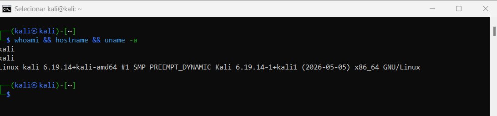
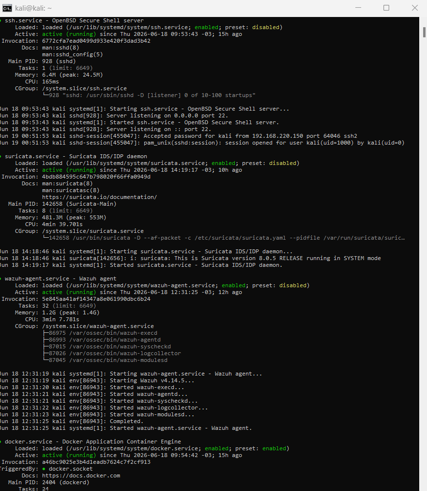
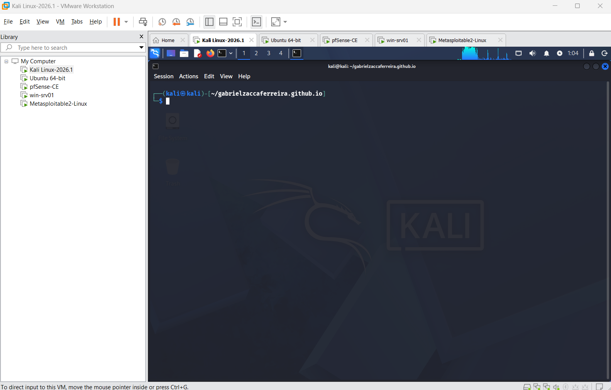
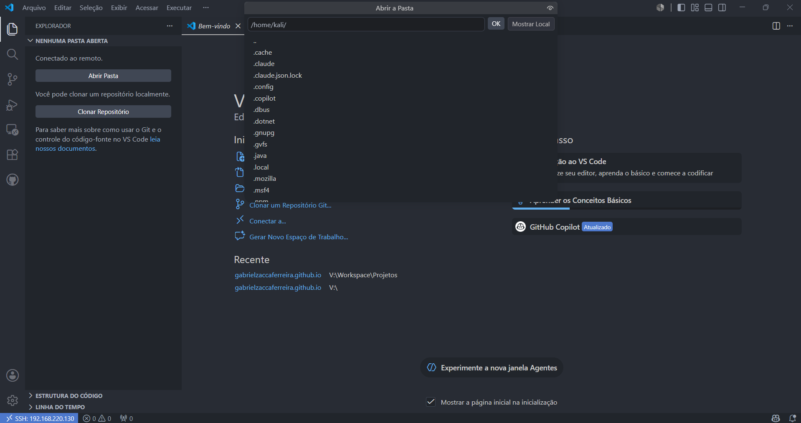

# Kali Linux Remote Access Lab

Laboratório prático de acesso remoto ao Kali Linux em VMware Workstation, utilizando SSH, XRDP e VS Code Remote SSH para administração, documentação técnica e operação remota do ambiente de estudos.

---

## Sumário

- [Objetivo](#objetivo)
- [Ambiente Utilizado](#ambiente-utilizado)
- [Topologia](#topologia)
- [Objetivos do Laboratório](#objetivos-do-laboratório)
- [Configuração de Rede](#configuração-de-rede)
- [Configuração do SSH](#configuração-do-ssh)
- [Testes de Conectividade](#testes-de-conectividade)
- [Conexão SSH](#conexão-ssh)
- [Configuração do XRDP](#configuração-do-xrdp)
- [VS Code Remote SSH](#vs-code-remote-ssh)
- [Troubleshooting](#troubleshooting)
- [Snapshot VMware](#snapshot-vmware)
- [Conhecimentos Aplicados](#conhecimentos-aplicados)
- [Laboratórios do SOC Home Lab](#-laboratórios-do-soc-home-lab)

---

## Objetivo

Implementar e documentar um ambiente de acesso remoto ao Kali Linux executando em uma máquina virtual VMware Workstation, permitindo administração remota via SSH, Visual Studio Code Remote SSH e Área de Trabalho Remota (XRDP).

---

# Ambiente Utilizado

## Hardware

### Host

* Windows 11
* VMware Workstation

### Cliente

* Notebook Windows 11

### Máquina Virtual

* Kali Linux
* XFCE Desktop

---

# Topologia

```text
Notebook
│
├── SSH
├── VS Code Remote SSH
└── RDP (XRDP)
        │
        ▼
Kali Linux VM
        │
        ▼
VMware Workstation
        │
        ▼
Windows 11 Host
        │
        ▼
Rede Local
```

---

# Objetivos do Laboratório

* Configurar acesso remoto ao Kali Linux
* Utilizar SSH para administração remota
* Utilizar VS Code Remote SSH para desenvolvimento e documentação
* Utilizar XRDP para acesso gráfico remoto
* Compreender configuração de rede Bridge no VMware
* Praticar troubleshooting de Linux e serviços

---

# Configuração de Rede

## VMware

Modo de Rede:

```text
Bridge
```

Objetivo:

Permitir que a máquina virtual receba um endereço IP diretamente da rede local.

---

## Verificação do Endereço IP

```bash
ip a
```

ou

```bash
hostname -I
```

Resultado:

```text
10.10.10.20
```

---

# Configuração do SSH

## Instalação

```bash
sudo apt update
sudo apt install openssh-server -y
```

## Inicialização

```bash
sudo systemctl enable ssh
sudo systemctl start ssh
```

## Verificação

```bash
sudo systemctl status ssh
```

---

# Testes de Conectividade

## Ping

No cliente:

```bash
ping 10.10.10.20
```

## Porta SSH

PowerShell:

```powershell
Test-NetConnection 10.10.10.20 -Port 22
```

Resultado esperado:

```text
TcpTestSucceeded : True
```

---

# Conexão SSH

```bash
ssh kali@10.10.10.20
```

---

# Configuração do XRDP

## Instalação

```bash
sudo apt install xrdp -y
```

## Dependências

```bash
sudo apt install xorgxrdp dbus-x11 -y
```

## Inicialização

```bash
sudo systemctl enable xrdp
sudo systemctl restart xrdp
```

---

# Configuração do XFCE

Arquivo:

```bash
~/.xsession
```

Conteúdo:

```text
xfce4-session
```

Configuração:

```bash
echo xfce4-session > ~/.xsession
```

---

# Configuração do x-session-manager

Verificação:

```bash
sudo update-alternatives --config x-session-manager
```

Configuração final:

```text
/usr/bin/xfce4-session
```

Verificação:

```bash
readlink -f /usr/bin/x-session-manager
```

Resultado:

```text
/usr/bin/xfce4-session
```

---

# VS Code Remote SSH

## Extensão

Remote - SSH (Microsoft)

## Host Configurado

```text
ssh kali@10.10.10.20
```

## Benefícios

* Administração remota
* Terminal integrado
* Edição remota de arquivos
* Integração com Git e GitHub

---

# Troubleshooting

## Problema

XRDP retornava para a tela de login após autenticação.

## Diagnóstico

Análise dos logs:

```bash
~/.xsession-errors
/var/log/xrdp-sesman.log
```

## Solução

* Configuração correta do arquivo `.xsession`
* Ajuste do `x-session-manager`
* Reinicialização dos serviços XRDP e LightDM

---

# Snapshot VMware

Snapshot criado:

```text
Kali-Remoto-Completo-v1
```

Objetivo:

Permitir rápida restauração do ambiente funcional.

---

# Evidências

As capturas ficam na pasta `screenshots/`.









---

# Conhecimentos Aplicados

* Linux Administration
* VMware Workstation
* Redes TCP/IP
* SSH
* XRDP
* XFCE
* Troubleshooting
* VS Code Remote SSH
* Administração Remota

---

# Evoluções Futuras

* Melhorar hardening do SSH;
* documentar automações de setup;
* organizar scripts de pós-instalação;
* manter integração com Wazuh, Suricata, CrowdSec, Docker e pfSense;
* criar snapshots por fase do laboratório.

---

## 🔗 Laboratórios do SOC Home Lab

| Lab | Repositório | Descrição |
|-----|-------------|-----------|
| 🛡️ Wazuh SIEM/XDR | [wazuh-lab](https://github.com/gabrielzaccaferreira/wazuh-lab) | Instalação, configuração e regras customizadas do Wazuh |
| 🐉 Kali Linux | [kali-remote-access-lab](https://github.com/gabrielzaccaferreira/kali-remote-access-lab) | Setup do ambiente de ataque e acesso remoto |
| 🔍 Suricata IDS/IPS | [suricata-lab](https://github.com/gabrielzaccaferreira/suricata-lab) | Detecção de intrusão em rede, regras customizadas |
| 🛡️ CrowdSec | [soc-lab-crowdsec-kali](https://github.com/gabrielzaccaferreira/soc-lab-crowdsec-kali) | IPS colaborativo com blocklists dinâmicas |
| 🔬 Wireshark | [wireshark-analysis-lab](https://github.com/gabrielzaccaferreira/wireshark-analysis-lab) | Análise de tráfego e dissecção de protocolos |
| 🔥 pfSense | [pfsense-lab](https://github.com/gabrielzaccaferreira/pfsense-lab) | Firewall, NAT, VLANs e regras de perímetro |
| 🪟 Windows Server + Sysmon | [windows-server-soc-lab](https://github.com/gabrielzaccaferreira/windows-server-soc-lab) | Telemetria Windows, Sysmon, Red Team vs Blue Team |

> 🌐 Portfólio completo: [gabrielzacca.com.br](https://gabrielzacca.com.br)

